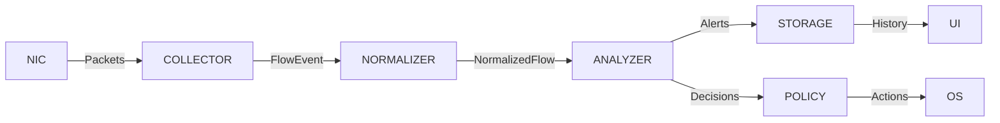
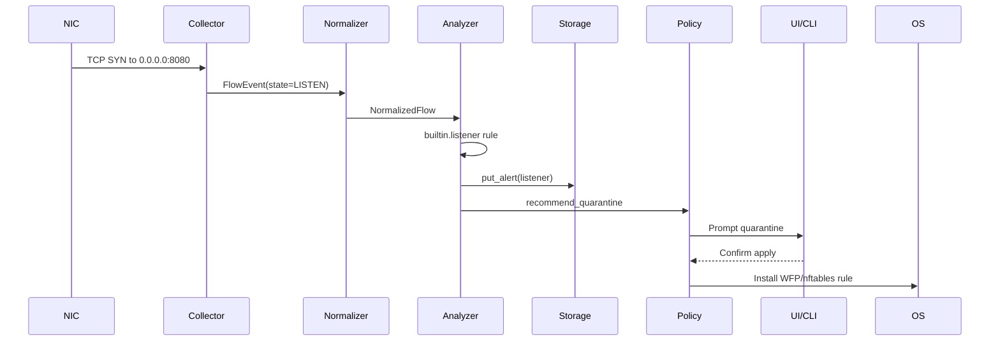

# Локальный мониторинг сетевых потоков — архитектурный план

## C4: Контекст
```mermaid
C4Context
    title NETS :: Контекст
    Boundary(system, "NETS Application") {
        Person(admin, "Администратор", "Отвечает за конфигурацию и реакцию")
        System_Boundary(nets, "NETS Stack") {
            System(netsd, "NETS Демон", "Сбор, аналитика, хранение")
            System_UI(ui, "NETS UI/CLI", "Просмотр потоков, управление")
        }
    }
    System_Ext(external_apps, "Локальные процессы", "Производят сетевые потоки")
    System_Ext(os, "ОС", "eBPF/ETW/WFP/Npcap")
    Rel(admin, ui, "Конфигурирование, просмотр")
    Rel(external_apps, netsd, "Генерируют сетевые события")
    Rel(os, netsd, "Предоставляет API наблюдения")
```

## C4: Контейнеры
```mermaid
C4Container
    title NETS :: Контейнеры
    Container_Boundary(core, "netsd") {
        Container(collector, "Collector", "Rust", "eBPF/ETW/XDP capture")
        Container(normalizer, "Normalizer", "Rust", "Унификация потоков")
        Container(analyzer, "Analyzer", "Rust", "Бейзлайн, аномалии, DSL")
        Container(storage, "Storage", "Rust + SQLite", "Шифрованное хранилище")
        Container(policy, "Policy", "Rust", "Локальные реакции")
        Container(rules, "Rules", "File", "Офлайн пакеты правил")
    }
    Container(ui, "UI", "Tauri/CLI", "Таблицы потоков, отчёты")
    Rel(admin, ui, "Использует")
    Rel(ui, analyzer, "Запрашивает алерты")
    Rel(ui, storage, "Читает историю")
    Rel(collector, normalizer, "Передаёт FlowEvents")
    Rel(normalizer, analyzer, "Подаёт NormalizedFlow")
    Rel(analyzer, storage, "Сохраняет алерты")
    Rel(analyzer, policy, "Передаёт решения")
    Rel(storage, ui, "Выдаёт потоковые данные")
```

## C4: Компоненты демона
```mermaid
C4Component
    title NETS :: Компоненты netsd
    Container_Boundary(netsd, "netsd") {
        Component(ebpf, "Collector::Linux", "aya/XDP" )
        Component(etw, "Collector::Windows", "ETW/WFP")
        Component(normalize, "Normalizer", "Оконные агрегаты")
        Component(detect, "Analyzer", "Бейзлайн и правила")
        Component(storage, "Storage", "SQLite + AES-GCM")
        Component(policy, "Policy", "nftables/WFP quarantine")
        Component(ipc, "IPC Server", "gRPC over UDS/Named Pipes")
    }
    Rel(ebpf, normalize, "FlowEvent")
    Rel(etw, normalize, "FlowEvent")
    Rel(normalize, detect, "NormalizedFlow")
    Rel(detect, storage, "Alert, Flow persistence")
    Rel(detect, policy, "QuarantineDecision")
    Rel(ipc, ui, "Запросы/Ответы")
```

## Dataflow


## Sequence: неожиданный listener


## Границы привилегий и IPC
* Привилегированный сегмент: Collector (eBPF, WFP), Policy (firewall). Работает как системный сервис под отдельным пользователем `netsd`, имеет Capability `CAP_BPF`/`CAP_NET_ADMIN` на Linux.
* Пользовательский сегмент: Analyzer, Normalizer, Storage, UI/CLI. Взаимодействие через локальный IPC:
  * Linux/macOS: gRPC over Unix Domain Socket `/var/run/netsd.sock`.
  * Windows: gRPC over Named Pipe `\\.\pipe\netsd`.
* IPC запросы: `SubscribeFlows`, `GetAlerts`, `ApplyQuarantine`, `ImportRules`.

## Нефункциональные требования
* **Производительность:** RAM ≤ 40 МБ, CPU ≤ 5%, sample rate configurable (по умолчанию каждый 10-й пакет, заголовок ≤ 256 байт).
* **Надёжность:** при переполнении ring-buffer Collector переходит в режим счётчиков (без payload). Back-pressure к Analyzer через асинхронные очереди.
* **Безопасность:**
  * AES-GCM шифрование SQLite с ключом из системного хранилища (Linux: `libsecret`, Windows: DPAPI).
  * Подпись драйверов/расширений, проверка целостности BPF.
  * Self-check отсутствия исходящих соединений (мониторинг собственных сокетов).

## Угрозмодель (STRIDE)
| Угроза | Описание | Митигация |
| --- | --- | --- |
| Spoofing | Подмена процесса при привязке PID | Проверка exe_path, sha256, подписей; периодическая валидация через `/proc`/ETW |
| Tampering | Модификация БД | AES-GCM + контроль целостности, контроль доступа к файлу |
| Repudiation | Отрицание действий | Аудит локальных действий с подписью журнала |
| Information Disclosure | Чтение чувствительных данных | Шифрование, маскирование, роль-based доступ |
| DoS | Переполнение ring-buffer, flood | Back-pressure, деградация до счётчиков, квоты |
| Elevation of Privilege | Злоупотребление карантином | RBAC, подтверждение через UI, тайм-ауты |

## Контракты данных
См. [data-schemas.md](data-schemas.md) для JSON Schema и Protobuf описаний.

## Таблица соответствия платформ
| Возможность | Linux | Windows | macOS | GAP |
| --- | --- | --- | --- | --- |
| L2 мониторинг | eBPF (TC/XDP), AF_PACKET | WFP callout, NDIS | BPF, PF | Требуется реализация NEFilterDataProvider |
| Привязка PID | `/proc` + cgroups | ETW + GetExtendedTcpTable | `proc_pidinfo` | macOS интеграция в бэклог |
| Карантин | nftables + ipsets | WFP фильтры | PF anchors | macOS правило PF TBD |
| UI | Tauri (webkit2gtk) | Tauri (WebView2) | Tauri | - |
| Пакетирование | .deb/.rpm | .msi | .dmg | Автоматизация .msi/.dmg | 

## GAP-план
1. **macOS backend:** реализовать BPF фильтры, PF управление.
2. **Аналитика расширенная:** JA3 fingerprinting, продвинутый DNS анализ.
3. **UI визуализация графов:** интеграция d3 через Tauri.
4. **Автономные обновления правил:** CLI для синхронизации с USB пакетов.
5. **Расширенные тесты производительности:** профилирование под высокой нагрузкой.
